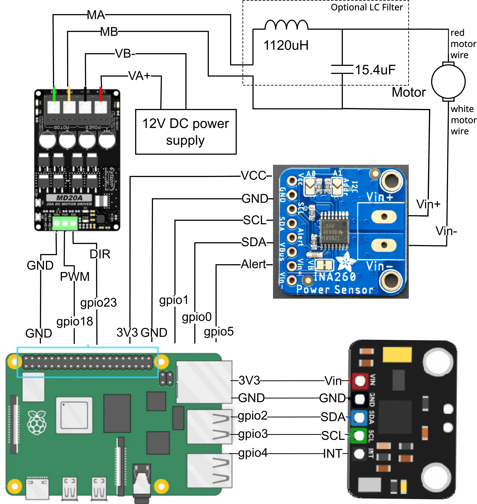

# Introduction
Welcome to the shakey-table GitHub page, developed by Adam Englebright, Torin Storkey, Gennady Magin, and Jambulingam Kothandapani.

As part of the Real Time Embedded Programming 5 course at the University of Glasgow,
we have been tasked with developing a project that requires real time programming under GNU/Linux on a Raspberry Pi.
The project we have decided on is a self-balancing cup holder, implemented using a reaction wheel.
Essentially, an inverted pendulum. This git repository contains the code required to run this
self-balancing cup holder and instructions on how to build it for both software and hardware.

We used a Pi 5, which introduced some extra challenges as its GPIO differs greatly from
previous versions, meaning that common libraries like `pigpio` would not work.
This project was only tested on a Pi 5 using the latest Raspberry Pi OS
(`uname -a` output: *Linux rpi5-2 6.6.21-v8-16k+ #1 SMP PREEMPT Tue Mar 12 11:01:10 UTC 2024 aarch64 GNU/Linux*).
We cannot guarantee that it will work on other versions of the Pi or on other operating systems
or OS versions.

# Software
## Prerequisites/Dependencies
The following Debian packages (Raspberry Pi OS is built on Debian and has access to Debian packages) are required for this program to build and run on a rpi5:
* `linux-libc-dev`
* `libi2c-dev`
* `make`
* `cmake`
* `g++`

The following packages are recommended:
* `git` for cloning the repository, although you can simply download the code from the GitHub website if you wish.
* `doxygen` for creating nice documentation from the comments in the code.
* `texlive-full` for compiling a PDF document from the LaTeX code created by Doxygen (which also creates a website that you can view in your browser,
so this is not necessary to view the documentation).

These packages can be installed using `sudo apt install <package name>`.

There are also installs required that cannot be found in the standard repos, primarily due to the use of a Pi 5:
* `libgpiod` v2 is required. However, the version on the Debian Bookworm repo as of 2024-03-03 is v1.6.3 (despite the package name being `libgpiod2`).
This must be installed from source. `git clone git://git.kernel.org/pub/scm/libs/libgpiod/libgpiod.git`
([repo link](https://git.kernel.org/pub/scm/libs/libgpiod/libgpiod.git/)) in a suitable place and follow the `README` instructions.
The advised options to pass to the `autogen.sh` script are `--enable-tools=yes` (not *necessary*, but provides useful command line tools)
and `--enable-bindings-cxx` (**necessary**, since this is a C++ program). Note that to build with C++ bindings, the `autoconf-archive` package is required
(this can be easily `apt install`'d from the Debian repos). You may also need to `apt install` the `libtool` package for the build to work.
* As of the latest kernel for the Pi 5 on 2024-04-03 (6.6.21-v8-16k+), this patch is required for PWM to work through the sysfs interface:
[https://github.com/raspberrypi/linux/pull/6026](https://github.com/raspberrypi/linux/pull/6026). Install using `sudo rpi-update pulls/6026`.
See [https://forums.raspberrypi.com/viewtopic.php?t=359251](https://forums.raspberrypi.com/viewtopic.php?t=359251),
particularly the [post by neuralassembly](https://forums.raspberrypi.com/viewtopic.php?p=2202349#p2202349) and onward.

### config.txt
To enable the I2C and PWM hardware on the Raspberry Pi 5, the following lines must be added to your `/boot/firmware/config.txt`:
* `dtparam=i2c_arm=on`
* `dtparam=i2c_vc=on,i2c_vc_baudrate=400000`
* `dtoverlay=pwm-2chan`

Remember to reboot your Pi after entering these lines. The `config.txt` used on our Pi can be found in the root of this repo.

## Building the Software
To build the software, follow these instructions:
* `git clone https://github.com/embeddedgyro/shakey-table.git`
* `cd shakey-table`
* `mkdir build` (It is advisable to create an *out-of-source* build, hence this and the following step.)
* `cd build`
* `cmake ..`
* `make`

After this, an executable program called **ShakeyTable** should exist under the `build/src/` directory.
That is, `build/src/ShakeyTable`. This program can be run by entering either the absolute or relative
path of the executable. For example, `/some/path/from/root/shakey-table/build/src/ShakeyTable`, or
`src/ShakeyTable` if you are still in the `build` directory. If you are in the same directory as the
executable, you can enter `./ShakeyTable` (the leading dot means *this directory*).

In addition to the main **ShakeyTable** executable, there will also be a **ShakeyTable_no_INA**
executable. This runs a version of the main program that doesn't use the INA260 current sensor
for torque control. Instead, it only uses the MPU6050 and a single PID controller for position control.
This program was developed as a backup in case the INA260 could not be configured to
work with the motor driver operating in both directions
([see the wiki](https://github.com/embeddedgyro/shakey-table/wiki/Hardware-Woes#the-ina260-current-sensor)).

There will also be two executables for testing the functionality of the MPU6050 and INA260,
named **mpu_testing** and **ina_testing**, respectively. **mpu_testing** will communicate with
the MPU6050 and continuously write the measured angular position to the screen.
**ina_testing** will do the same with the INA260, continuously writing out the measured
current to the screen. These test programs are useful for confirming that the sensors
have been correctly connected to the Pi and are functioning properly.

## Documentation
Documentation of this project is provided by Doxygen formatted comments in the code.
Doxygen can be used to create a website and PDF document that organise the documentation
in a way that is clear, easy to navigate, and easy to read.

### Website
To create the documentation website, run `make doc` after the `cmake ..` command from the above build instructions.
Running `cmake ..` will create a Doxyfile, and running `make doc` will run Doxygen on this file to generate
the documentation website under the `build/html/` directory.

To view this website, open your browser of choice.
In the URL bar, enter `file:///some/path/from/root/shakey-table/build/html/index.html`. This will open the
main page of the website. From there you can find the rest of the documentation using the navigation
tools at the top of the page.

### PDF Document
After running `make doc`, there will also be a `build/latex/` directory. If you have a TeX distribution
installed, you can `cd` into this directory and enter `make`. This will invoke `pdflatex` to generate
a PDF document called `refman.pdf`, which will contain the Doxygen generated documentation for the project.
View with your PDF reader of choice. Most browsers can also view PDF documents.

# Unit Testing
ShakeyTable on the whole has three modules namely `MPU6050`, `INA260` and `Cytron MD20A` along with PID control functionality. When developing unit testing we intend to validate each module's functionalities by a specific set of test cases and consolidated them into `Online` and `Offline` testing based on its nature of examination. Online unit testing validates  each module's communication status to raspberry pi through i2c bus. Hence to run online testing each module has to be configured into the overall setup and actively involved in communication. On the other hand offline testing intend to validate the static functionalities of the software, examining the expected output against the module's program output. These testing can be validated when the setup is offline to ensure proper functioning of the software.
	
## Building Unit Tests
Follow the software building procedure as mentioned before which includes cloning the repo and building the system through commands `cmake .. make`. This will generate the executable files for each module's unit testing functions. Now type `ctest` in the same directory to view the results of both online and offline testing together. You can also view the results of either one testing through the command `ctest -R online` or `ctest -R offline` which executes only the files associated to those testing. Individual executable files for concern modules can be found in the directory `./test/****/**`. Here `./` indicates that you are required to be currently in `build` directory and `****` indicates the module that you intended to view the executables (eg., mpu6050, ina260) and `**` specifies the specific test file executable.
	eg., `./test/mpu6050/mpu6050_AccelOffset_ut`.

## Unit Testing Output
Each unit test will either pop `Passed` if successfully executed without exception or `Subprocess aborted***Exception:` with the exception scenario encountered if failed.

# Hardware

## Components

This section describes hardware components used in this project, and what is their purpose. Descritions are followed by links to datasheets for those components and information about how they should be wired and positioned on a physical prototype. All supporting reference images for this section can be found in "Hardware Assembly" section of this README.

The following components were used for this project:

* Microcontroller - Raspberry Pi 5. Used for executing the main program and interfacing with sensors and motor driver.

Documentation for it can be found here [https://www.raspberrypi.com/documentation/](https://www.raspberrypi.com/documentation/).

* Current Sensor - INA260. Used for reading current flowing through the motor for PID motor control as current is proportional to the torque generated by the motor. Uses I2C communication protocol for interfacing with Pi.

Datasheet can be found here [https://www.ti.com/lit/ds/symlink/ina260.pdf](https://www.ti.com/lit/ds/symlink/ina260.pdf).

Should be connected in series with the motor. Vin- terminal is connected to the white wire on the motor and Vin+ is connected to the MB terminal of the motor driver. Powered by a 3V3 supply from the Pi. Communicates with the Pi through I2C1 pins (SDA->gpio27, SCL->gpio28) which don't have internal pull-up resistors, but there are pull-up resistors inside the current sensor, so that should not be a problem. The Alert pin is connected to gpio5 on the Pi.

* Gyro-Acelerometer Sensor - MPU6050. Measures the acceleration of the table in a 2D plane and subtracts the centripetal acceleration from it to get the acceleration due to gravity. Measurements are used for PID motor control. Uses I2C communication protocol for interfacing with Pi.

Datasheet can be found here [https://mm.digikey.com/Volume0/opasdata/d220001/medias/docus/2204/SEN0142_Web.pdf](https://mm.digikey.com/Volume0/opasdata/d220001/medias/docus/2204/SEN0142_Web.pdf).

Should be mounted firmly to the surface of the table with connection pins facing the ground. Position reference image can be found in "Hardware Assembly" section of the README. Powered by a 3V3 supply from the Pi. Communicates with the Pi through I2C0 pins (SDA->gpio2, SCL->gpio3) which have internal pull-up resistors. No extra external circuitry is needed. Interrup pin should be connected to gpio4.

* Motor Driver - Cytron MD20A. Regulates voltage supplied to the motor. Controls the direction and speed of motor rotation with PWM.

Datasheet can be found here [https://robu.in/wp-content/uploads/2019/05/MD20A-Datasheet.pdf](https://robu.in/wp-content/uploads/2019/05/MD20A-Datasheet.pdf).

Uses a 12V external DC power supply connected to VA+ and VB- for delivering power to the motor. In this project, an external power generator was used for this purpose. Use thick multicore wires with good isolation for power lines. Controls the motor rotation by receiving a 20kHz PWM signal with a PID-controlled Duty Cycle from gpio18 on the Pi. Direction is controlled by a High-Low output from gpio23 into the DIR pin on the motor driver.

* Motor - 12V DC Motor 12kg-cm 350RPM w/Encoder. Used for rotating the reaction wheel and creating the necessary torque for table stabilisation.

 Device specifications are mentioned on this website [https://uk.robotshop.com/products/12v-dc-motor-12kg-cm-350rpm-encoder](https://uk.robotshop.com/products/12v-dc-motor-12kg-cm-350rpm-encoder).

The  white motor wire should be connected to the Vin- terminal on the INA260, and red motor wire should be connected to the junction between the capacitros and inductors inside the LC filter.

* Low-Pass Filter (optional element) - LC filter with a cut-off at about 1200Hz to eliminate high-frequency noise coming from the motor driver and Pi PWM signal.

Uses two 560uH choke inductors(`MCAP115018077A-561LU`) after MA terminal on the motor driver in series with the motor (connect to red motor wire) and the current sensor. Seven 2.2uF polyester film capacitors(`7212-707`) are connected after inductors in parallel around the current sensor and motor driver. At high frequencies, the inductor becomes very resistive and blocks high-frequency signals from passing into the circuit. The capacitor becomes a short circuit for high-frequency signals. High frequencies flow through it, avoiding the current sensor and the motor. Inductors with a high current rating above 10A and capacitors with a high voltage rating above 20V should be used in this project to prevent damage and burning of the filter. Polarised capacitors cannot be used, as current can flow in both directions in this circuit.

WARNING! If there is not a lot of noise that disrupts current sensor readings, we reccommend not to use this compoenent as it might cause I2C communication issues and damage sensors due to high current and voltage spikes during the switching of the direction and duty cycle of motor rotation.

## Hardware Assembly

This section contains all reference image materials for wiring and positioning hardware components.

This image represents the wiring of the whole setup:

This image shows pin configuration on the Raspberry Pi 5 for assembly:

This image shows the correct position of the gyro-accelerometer on the shakey table:

## CAD Design

# Social Media 

Our project was advertised via Instagram [https://www.instagram.com/antiquakegu/](https://www.instagram.com/antiquakegu/) and Twitter [https://twitter.com/shakey_table](https://twitter.com/shakey_table).

Instagram was our main target. We got 120 followers, out of which 50 were constantly active, reacting on our stories, supporting us in the comments and liking our posts. Our strategy was to start advertysing our project when we were ready to start building and testing our prototype with actual hardware, as general audience is not interested in the coding side of the project on social media. We started advertising our product when we had our project fully planned and ready on the software side. 

We were posting stories of our work on the prototype every 2-3 days (you can see some of them in the highlights section called "project dev"), and tried to guide our audience through different development stages of the protype, share our wins, failiures and soltions to problems we faced on our path. We were also releasing 2 posts a week that summerised our main achievements and familiarised people with what we were actually doing. We tried to make it as non-technical as possible not to bore people with unnessessary details, but we were always happy to answer any questions in the comments.
